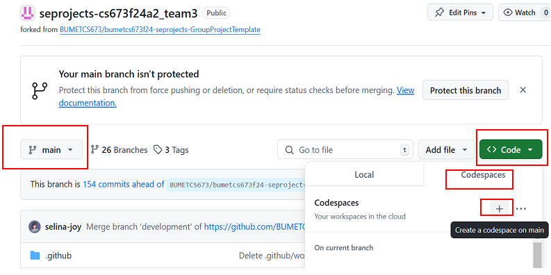
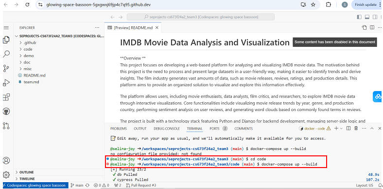

# Instructions to Run the Project

## Prerequisites

1. **Install Docker and Docker Compose**  
   Ensure Docker and Docker Compose are installed if using Method 1.  

2. **Check Port Availability**  
   Ensure the following ports are not being used on your system:  
   - **3306** (MySQL)  
   - **8000** (Django)  

---

## Method 1: Running Locally with Docker Compose

1. **Download the Code**  
   - Download or clone the project repository.  
   - Navigate to the code folder in the terminal:
     ```bash
     cd /path/to/project-root/code
     ```

2. **Pull the Docker Image**  
   - Pull the application image from Docker Hub:
     ```bash
     docker pull xuanshengxia/my_django_app:latest
     ```

3. **Start the Project**  
   - Run the following command to start the services:
     ```bash
     docker compose up -d
     ```

4. **Access the Application**  
   - Open a browser and visit:
     ```http
     http://localhost:8000
     ```

---

## Method 2: Running in GitHub Codespaces

1. **Set Up Codespaces**  
   - Open the **Code** panel in your GitHub repository.  
   - Select the **Codespaces** tab and click the **Add (+)** button to create a new Codespace.


2. **Run the Project**  
   - When the Codespace is active and on the main branch, run the following commands:
     ```bash
     cd code
     docker-compose up --build
     ```


3. **Access the Application**  
   - The terminal will display a link when the application starts running. Click the link to load the application's home page.


